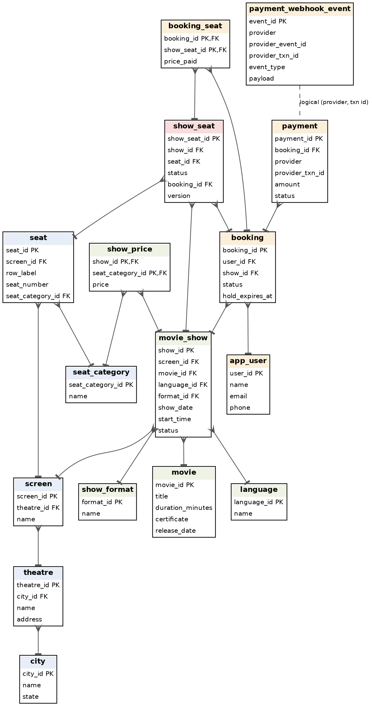

# BookMyShow-scale Ticketing Backend
*P1 (schema and locking strategy) and P2 (shows by theatre and date)*

Target database: **MySQL 8.0+** (verified on 8.0.46-0ubuntu0.24.04.4). Every query in this document was executed; the example rows and outputs below are real output from a run on 2026-09-28. Show dates in the seed data are relative to `CURDATE()`, so the 'next 7 days' date picker always has data.

## 1. Scope and what is delivered

- **P1** - entities, attributes, table structures, `CREATE TABLE` SQL, sample rows, 1NF/2NF/3NF/BCNF analysis, and a locking strategy that prevents double-booked seats and lost holds (`sql/01_schema.sql`, `sql/02_seed.sql`, `sql/04_locking_patterns.sql`).
- **P2** - the query listing all shows at a theatre on a date with their timings (`sql/03_p2_queries.sql`).
- **Beyond the brief, to back the concurrency claim:** a runnable test that races 100+ real connections against the same rows and checks invariants inside the database (`tests/concurrency_test.py`). Results are in section 7.
- **Not built here:** the Redis hold layer, the payment-gateway integration, the HTTP API and the burst queue. Section 5 describes how Redis would sit in front of this schema; nothing in section 7 exercises Redis.

## 2. Entities and relationships

Sixteen tables in four groups: venue catalogue (city, theatre, screen, seat_category, seat), film catalogue and scheduling (language, show_format, movie, movie_show, show_price), customers and orders (app_user, booking, booking_seat), and the two tables that carry the concurrency guarantees (show_seat, and the payment / payment_webhook_event pair). Crow's foot end = many side. The dashed line is a logical link only: webhook events are stored before we know they are valid, so it is deliberately not a foreign key.



## 3. Tables, attributes and example rows

Column types, keys and nullability come straight from `information_schema`. Auto-populated timestamp columns (created_at, updated_at, received_at) are omitted from the example rows to keep them readable.

### city

Cities in which theatres operate.

| Column | Type | Keys / flags | Notes |
|---|---|---|---|
| city_id | int unsigned | PK |  |
| name | varchar(80) |  |  |
| state | varchar(80) |  |  |

Example rows:

| city_id | name | state |
|---|---|---|
| 1 | Pune | Maharashtra |
| 2 | Mumbai | Maharashtra |

### theatre

A cinema venue in a city (the entity the date-picker page is about).

| Column | Type | Keys / flags | Notes |
|---|---|---|---|
| theatre_id | int unsigned | PK |  |
| city_id | int unsigned | FK -> city |  |
| name | varchar(120) |  |  |
| address | varchar(255) |  |  |

Example rows:

| theatre_id | city_id | name | address |
|---|---|---|---|
| 1 | 1 | PVR Phoenix Marketcity | Viman Nagar, Pune |
| 2 | 1 | INOX Amanora | Hadapsar, Pune |
| 3 | 2 | PVR Juhu | Juhu, Mumbai |

### screen

An auditorium inside a theatre; owns a fixed seat layout.

| Column | Type | Keys / flags | Notes |
|---|---|---|---|
| screen_id | int unsigned | PK |  |
| theatre_id | int unsigned | FK -> theatre |  |
| name | varchar(40) |  |  |

Example rows:

| screen_id | theatre_id | name |
|---|---|---|
| 1 | 1 | Audi 1 |
| 2 | 1 | Audi 2 |
| 3 | 2 | Audi 1 |
| 4 | 3 | Audi 1 |

### seat_category

Pricing tier of a seat (SILVER / GOLD / RECLINER).

| Column | Type | Keys / flags | Notes |
|---|---|---|---|
| seat_category_id | tinyint unsigned | PK |  |
| name | varchar(30) | UNIQUE |  |

Example rows:

| seat_category_id | name |
|---|---|
| 1 | SILVER |
| 2 | GOLD |
| 3 | RECLINER |

### seat

Physical seat in a screen. Exists once, independent of any show.

| Column | Type | Keys / flags | Notes |
|---|---|---|---|
| seat_id | int unsigned | PK |  |
| screen_id | int unsigned | FK -> screen |  |
| row_label | varchar(2) |  |  |
| seat_number | smallint unsigned |  |  |
| seat_category_id | tinyint unsigned | FK -> seat_category |  |

Example rows:

| seat_id | screen_id | row_label | seat_number | seat_category_id |
|---|---|---|---|---|
| 10 | 1 | A | 1 | 1 |
| 11 | 1 | B | 1 | 2 |
| 12 | 1 | C | 1 | 3 |
| 22 | 1 | A | 2 | 1 |
| 23 | 1 | B | 2 | 2 |
| 24 | 1 | C | 2 | 3 |

### language

Audio language a show is played in.

| Column | Type | Keys / flags | Notes |
|---|---|---|---|
| language_id | smallint unsigned | PK |  |
| name | varchar(40) | UNIQUE |  |

Example rows:

| language_id | name |
|---|---|
| 1 | Hindi |
| 2 | English |
| 3 | Telugu |

### show_format

Projection format (2D, 3D, IMAX 2D).

| Column | Type | Keys / flags | Notes |
|---|---|---|---|
| format_id | smallint unsigned | PK |  |
| name | varchar(30) | UNIQUE |  |

Example rows:

| format_id | name |
|---|---|
| 1 | 2D |
| 2 | 3D |
| 3 | IMAX 2D |

### movie

A film in the catalogue.

| Column | Type | Keys / flags | Notes |
|---|---|---|---|
| movie_id | int unsigned | PK |  |
| title | varchar(200) |  |  |
| duration_minutes | smallint unsigned |  |  |
| certificate | varchar(5) |  |  |
| release_date | date |  |  |

Example rows:

| movie_id | title | duration_minutes | certificate | release_date |
|---|---|---|---|---|
| 1 | Kalki 2898 AD | 181 | UA | 2024-06-27 |
| 2 | Dune: Part Two | 166 | UA | 2024-03-01 |
| 3 | Inside Out 2 | 96 | U | 2024-06-14 |

### movie_show

One screening: a movie on a screen at a date and start time. (Named movie_show because SHOW is reserved in MySQL.)

| Column | Type | Keys / flags | Notes |
|---|---|---|---|
| show_id | bigint unsigned | PK |  |
| screen_id | int unsigned | FK -> screen |  |
| movie_id | int unsigned | FK -> movie |  |
| language_id | smallint unsigned | FK -> language |  |
| format_id | smallint unsigned | FK -> show_format |  |
| show_date | date |  | Business date of the show; drives the P2 lookup |
| start_time | time |  | end time is derived (start + movie duration), not stored |
| status | enum('SCHEDULED','CANCELLED','COMPLETED') |  |  |

Example rows:

| show_id | screen_id | movie_id | language_id | format_id | show_date | start_time | status |
|---|---|---|---|---|---|---|---|
| 1 | 1 | 1 | 1 | 1 | 2026-09-28 | 22:00 | SCHEDULED |
| 2 | 1 | 1 | 1 | 1 | 2026-09-28 | 18:30 | SCHEDULED |
| 32 | 2 | 2 | 2 | 3 | 2026-09-28 | 20:00 | SCHEDULED |
| 33 | 2 | 2 | 2 | 3 | 2026-09-28 | 15:30 | SCHEDULED |
| 34 | 2 | 2 | 2 | 3 | 2026-09-28 | 11:30 | SCHEDULED |
| 63 | 2 | 3 | 2 | 1 | 2026-09-28 | 09:00 | SCHEDULED |
| 64 | 3 | 1 | 3 | 2 | 2026-09-28 | 13:00 | SCHEDULED |
| 65 | 4 | 2 | 2 | 1 | 2026-09-28 | 19:00 | SCHEDULED |

### show_price

Price of each seat tier for a specific show.

| Column | Type | Keys / flags | Notes |
|---|---|---|---|
| show_id | bigint unsigned | PK, FK -> movie_show |  |
| seat_category_id | tinyint unsigned | PK, FK -> seat_category |  |
| price | decimal(8,2) |  |  |

Example rows:

| show_id | seat_category_id | price |
|---|---|---|
| 1 | 1 | 250.00 |
| 1 | 2 | 350.00 |
| 1 | 3 | 550.00 |
| 2 | 1 | 250.00 |
| 2 | 2 | 350.00 |
| 2 | 3 | 550.00 |

### app_user

A registered customer.

| Column | Type | Keys / flags | Notes |
|---|---|---|---|
| user_id | bigint unsigned | PK |  |
| name | varchar(120) |  |  |
| email | varchar(190) | UNIQUE |  |
| phone | varchar(20) | UNIQUE |  |
| created_at | timestamp |  |  |

Example rows:

| user_id | name | email | phone |
|---|---|---|---|
| 1 | Aarav Sharma | aarav@example.com | +919800000001 |
| 2 | Diya Patel | diya@example.com | +919800000002 |
| 3 | Kabir Singh | kabir@example.com | +919800000003 |

### booking

A customer's attempt/purchase for one show. PENDING while seats are held and payment is outstanding.

| Column | Type | Keys / flags | Notes |
|---|---|---|---|
| booking_id | bigint unsigned | PK |  |
| user_id | bigint unsigned | FK -> app_user |  |
| show_id | bigint unsigned | FK -> movie_show |  |
| status | enum('PENDING','CONFIRMED','CANCELLED','EXPIRED') |  | PENDING / CONFIRMED / CANCELLED / EXPIRED |
| hold_expires_at | datetime |  | hold deadline; swept by idx_booking_sweeper |
| created_at | timestamp |  |  |
| confirmed_at | datetime | NULL |  |

Example rows:

| booking_id | user_id | show_id | status | hold_expires_at | confirmed_at |
|---|---|---|---|---|---|
| 1 | 1 | 1 | CONFIRMED | 2026-09-28 10:29 | 2026-09-28 10:19 |
| 2 | 2 | 1 | PENDING | 2026-09-28 10:29 | NULL |
| 3 | 3 | 1 | EXPIRED | 2026-09-28 10:14 | NULL |

### show_seat

Inventory row per (show, seat). The concurrency-control table: every hold / confirm / release is a compare-and-set here.

| Column | Type | Keys / flags | Notes |
|---|---|---|---|
| show_seat_id | bigint unsigned | PK |  |
| show_id | bigint unsigned | FK -> movie_show |  |
| seat_id | int unsigned | FK -> seat |  |
| status | enum('AVAILABLE','HELD','BOOKED') |  | AVAILABLE / HELD / BOOKED |
| booking_id | bigint unsigned | FK -> booking, NULL | current holder/owner; NULL iff AVAILABLE (CHECK) |
| version | int unsigned |  | optimistic-lock counter, +1 on every transition |
| updated_at | timestamp |  |  |

Example rows:

| show_seat_id | show_id | seat_id | status | booking_id | version |
|---|---|---|---|---|---|
| 81 | 1 | 11 | BOOKED | 1 | 1 |
| 82 | 1 | 23 | BOOKED | 1 | 1 |
| 92 | 1 | 48 | HELD | 2 | 1 |
| 93 | 1 | 60 | HELD | 2 | 1 |

### booking_seat

Immutable line items of a booking (which seats, at what price). Kept after expiry/cancel for history.

| Column | Type | Keys / flags | Notes |
|---|---|---|---|
| booking_id | bigint unsigned | PK, FK -> booking |  |
| show_seat_id | bigint unsigned | PK, FK -> show_seat |  |
| price_paid | decimal(8,2) |  | price snapshot at hold time |

Example rows:

| booking_id | show_seat_id | price_paid |
|---|---|---|
| 1 | 81 | 350.00 |
| 1 | 82 | 350.00 |
| 2 | 92 | 550.00 |
| 2 | 93 | 550.00 |
| 3 | 1 | 250.00 |

### payment

A payment attempt for a booking at a gateway.

| Column | Type | Keys / flags | Notes |
|---|---|---|---|
| payment_id | bigint unsigned | PK |  |
| booking_id | bigint unsigned | FK -> booking |  |
| provider | varchar(30) |  |  |
| provider_txn_id | varchar(64) |  | gateway id; UNIQUE with provider |
| amount | decimal(10,2) |  |  |
| status | enum('INITIATED','SUCCESS','FAILED','REFUNDED') |  |  |
| created_at | timestamp |  |  |

Example rows:

| payment_id | booking_id | provider | provider_txn_id | amount | status |
|---|---|---|---|---|---|
| 1 | 1 | razorpay | pay_Nx001 | 700.00 | SUCCESS |
| 2 | 2 | razorpay | pay_Nx002 | 1100.00 | INITIATED |

### payment_webhook_event

Inbox of gateway webhook deliveries. Its unique key is what makes webhook handling idempotent.

| Column | Type | Keys / flags | Notes |
|---|---|---|---|
| event_id | bigint unsigned | PK |  |
| provider | varchar(30) |  |  |
| provider_event_id | varchar(64) |  | gateway's event id; UNIQUE with provider = idempotency key |
| provider_txn_id | varchar(64) |  |  |
| event_type | varchar(40) |  |  |
| payload | json |  | raw JSON stored verbatim for audit |
| received_at | timestamp |  |  |
| processed_at | datetime | NULL |  |

Example rows:

| event_id | provider | provider_event_id | provider_txn_id | event_type | payload | processed_at |
|---|---|---|---|---|---|---|
| 1 | razorpay | evt_0001 | pay_Nx001 | payment.captured | {"amount": 70000, "status": "captured", "currency": "INR"} | 2026-09-28 10:19 |

## 4. Normalization (1NF, 2NF, 3NF, BCNF)

**1NF.** Every column holds one atomic value and there are no repeating groups. The seats of a booking are rows in `booking_seat`, not a list column; a movie's timings are rows in `movie_show`, not a comma list (the comma-joined view in P2 is produced by the query, not stored). The one deliberate exception is `payment_webhook_event.payload` (JSON): it is the gateway's raw document kept verbatim for audit and replay, and no query in this design reads inside it.

**2NF.** Every table with a composite key has non-key columns that depend on the whole key. `show_price` (show_id, seat_category_id) -> price needs both halves: the same tier costs different amounts on different shows and different tiers cost different amounts on one show. `booking_seat` (booking_id, show_seat_id) -> price_paid likewise. All other tables use single-column surrogate keys.

**3NF and BCNF.** In each table below, every determinant is a candidate key, so there are no transitive dependencies and BCNF holds.

| Table | Candidate keys | Functional dependencies (all determinants are keys) |
|---|---|---|
| city | city_id; (name, state) | city_id -> name, state |
| theatre | theatre_id; (city_id, name) | theatre_id -> city_id, name, address |
| screen | screen_id; (theatre_id, name) | screen_id -> theatre_id, name |
| seat_category / language / show_format | id; name | id <-> name |
| seat | seat_id; (screen_id, row_label, seat_number) | seat_id -> screen_id, row, number, category |
| movie | movie_id; (title, release_date) | movie_id -> title, duration, certificate, release_date |
| movie_show | show_id; (screen_id, show_date, start_time) | show_id -> screen, movie, language, format, date, time, status |
| show_price | (show_id, seat_category_id) | (show_id, category) -> price |
| app_user | user_id; email; phone | user_id -> name, email, phone |
| booking | booking_id | booking_id -> user, show, status, hold_expires_at, confirmed_at |
| show_seat | show_seat_id; (show_id, seat_id) | show_seat_id -> show, seat, status, booking_id, version |
| booking_seat | (booking_id, show_seat_id) | (booking, show_seat) -> price_paid |
| payment | payment_id; (provider, provider_txn_id) | payment_id -> booking, provider, txn id, amount, status |
| payment_webhook_event | event_id; (provider, provider_event_id) | event_id -> txn id, type, payload, times |

**Design decisions that keep this in 3NF** (each is a column we chose NOT to store):

- `movie_show` has no `theatre_id`: the theatre is determined by the screen (screen_id -> theatre_id), so storing it would be a transitive dependency. P2 reaches it through `screen`.
- `movie_show` has no `end_time`: it would be a function of (movie_id, start_time) - both non-key columns - which is a 3NF violation. P2 computes it as start_time + movie.duration_minutes.
- `booking` has no `total_amount`: it is SUM(booking_seat.price_paid), so it is computed, never stored, and can never disagree with its line items.
- `show_seat` has no `price`: it is derivable from show_price and seat.seat_category_id.

**Two places where stored data looks redundant, and why each is a real fact rather than a duplicate:**

- `booking_seat.price_paid` is a snapshot of what the customer was charged. `show_price` can change after the sale, so the snapshot cannot be recomputed later; it is a historical fact.
- Ownership of a seat is recorded twice: `show_seat.booking_id` (current state, mutable) and `booking_seat` (immutable history). This is intentional. `show_seat.booking_id` is what allows a seat to be claimed with one single-row compare-and-set, which is the core of the locking strategy. It depends only on the key `show_seat_id`, so it passes 3NF/BCNF; the price of this design is that the release path must clear it, which the sweeper does (section 5).
- `seat.seat_category_id` is a per-seat attribute, not a per-row one, because real screens have mixed rows (recliner blocks, wheelchair bays). If a theatre guaranteed one tier per row, (screen_id, row_label) -> category would hold and this table would need to be split to stay in BCNF.

## 5. Locking strategy: no double bookings, no lost holds

### 5.1 Invariants and how the schema enforces each

| Invariant | Enforced by |
|---|---|
| I1. A seat in a show belongs to at most one booking | UNIQUE (show_id, seat_id) so one row per seat per show; the hold is a conditional UPDATE (`... AND status='AVAILABLE'`), so InnoDB's row lock lets exactly one racer match; CHECK (status='AVAILABLE') iff booking_id IS NULL |
| I2. A hold is all-or-nothing | Insert booking + UPDATE seats + insert line items in one transaction; application compares ROW_COUNT() with the number of seats requested and rolls back on a shortfall |
| I3. Holds expire and are never lost | booking.hold_expires_at + a two-step, idempotent sweeper (section 5.4). A crash between the steps is finished by the next run |
| I4. A payment event is applied at most once | UNIQUE (provider, provider_event_id); insert-first in the same transaction as the business effect (section 5.5) |
| I5. A late payment cannot revive an expired hold | Confirm predicate `status='PENDING' AND hold_expires_at > NOW()`; 0 rows affected means refund |

### 5.2 Pessimistic vs optimistic locking

|   | Pessimistic (SELECT ... FOR UPDATE) | Optimistic (compare-and-set / version) |
|---|---|---|
| How | Lock the rows, read, decide in the app, write, commit | Write only if the row is still in the state we read (`status='AVAILABLE'`, or `version = ?`) |
| Strength | Simple reasoning when a decision spans many rows or needs a read first; no retries | Nothing is locked while the app thinks; fails fast; one round trip |
| Weakness | Locks live across network round trips; hot seats form lock-wait queues; deadlocks unless lock order is fixed | Under heavy contention many attempts fail and repeat work; app must handle 0-row updates |
| Fits when | Short critical section, frequent conflicts, multi-row rules | Conflicts are rare or losing is an acceptable outcome |

**Choice.** The hot path (hold seats) is a single-statement compare-and-set inside a short transaction. InnoDB still takes a brief row lock while the UPDATE runs, so the database serialises racers; what we avoid is holding a lock across the application's thinking time. The usual downside of optimistic locking (retry storms) does not apply here, because a lost race on a seat is a business outcome, not an error to retry: the user is told the seat was just taken and picks another. The hold UPDATE runs as a range scan on `uq_show_seat` that examines only the requested rows (checked with EXPLAIN UPDATE), so it locks just those seats, in seat_id order. A consistent lock order removes the classic deadlock between two overlapping multi-seat requests, but it is not a proof that no deadlock can ever occur, so the application still retries on error 1213 (deadlock) and 1205 (lock timeout); section 7 reports how often that happened. The pessimistic form (`FOR UPDATE NOWAIT`, or `SKIP LOCKED` to auto-pick free seats) is included in `04_locking_patterns.sql` for flows that must read and apply rules across several rows before writing. The 10-minute payment window is never a database lock: a hold is a state (`HELD` plus an expiry), not an open transaction.

### 5.3 Where Redis fits (design only - not implemented or tested here)

A Redis key per seat (`SET seat:{show}:{seat} <booking> NX PX 600000`, or a Lua script for all-or-nothing on several seats) would act as a fast gate in front of MySQL: requests for seats already held are rejected without touching the database, and the key's TTL gives an instant, timer-based release from the seat map. Correctness does not depend on it: if Redis is flushed or unavailable, the MySQL compare-and-set above still prevents a double booking. The sweeper reconciles any drift between Redis expiry and the database.

### 5.4 Hold expiry sweeper

```
-- D1: claim expired holds                      -- D2: release their seats
UPDATE booking SET status='EXPIRED'             UPDATE show_seat ss JOIN booking b ON b.booking_id=ss.booking_id
 WHERE status='PENDING'                            SET ss.status='AVAILABLE', ss.booking_id=NULL, ss.version=ss.version+1
   AND hold_expires_at <= NOW();                 WHERE ss.status='HELD' AND b.status IN ('EXPIRED','CANCELLED');
```

Both steps are idempotent and safe to run from many workers at once. D2 keys off the booking's status rather than off what D1 changed, so a crash between the two statements leaves nothing stuck: the next run releases those seats. That is what 'no lost holds' means in this design.

### 5.5 Idempotent payment webhooks

The handler starts a transaction and inserts the event first. A redelivery hits the unique key (error 1062), so the handler rolls back, returns 200 and does nothing. The insert and the business effects (payment SUCCESS, booking CONFIRMED, seats BOOKED) commit together; if the process dies midway, the event row rolls back with the effects and the gateway's retry runs the whole thing again. If the hold has already expired, the confirm matches 0 rows and the handler flags the payment for refund instead of resurrecting the booking.

### 5.6 Indexes and the queries they serve

| Index | Serves |
|---|---|
| movie_show UNIQUE (screen_id, show_date, start_time) | P2 lookup by screen and date; also stops a screen starting two shows at the same instant |
| screen UNIQUE (theatre_id, name) | P2: find a theatre's screens |
| show_seat UNIQUE (show_id, seat_id) | Row identity per show; the lock target and lock order for holds |
| show_seat (show_id, status) | Seat map and seats-left counts for a show |
| show_seat (booking_id) | Confirm / release all seats of a booking |
| booking (status, hold_expires_at) | Expiry sweeper scans only PENDING holds that are due |
| payment_webhook_event UNIQUE (provider, provider_event_id) | Idempotency key |
| payment UNIQUE (provider, provider_txn_id) | Match a webhook to its payment |

## 6. SQL

### 6.1 P1 - schema (sql/01_schema.sql)

```sql
-- =====================================================================
-- BookMyShow-scale ticketing backend  |  P1: schema  |  MySQL 8.0+
-- Run:  mysql -u root -p < sql/01_schema.sql
-- =====================================================================
DROP DATABASE IF EXISTS bookmyshow;
CREATE DATABASE bookmyshow CHARACTER SET utf8mb4 COLLATE utf8mb4_0900_ai_ci;
USE bookmyshow;

-- ---------------------------------------------------------------------
-- Reference / catalogue tables
-- ---------------------------------------------------------------------
CREATE TABLE city (
  city_id  INT UNSIGNED NOT NULL AUTO_INCREMENT,
  name     VARCHAR(80)  NOT NULL,
  state    VARCHAR(80)  NOT NULL,
  PRIMARY KEY (city_id),
  UNIQUE KEY uq_city_name_state (name, state)
) ENGINE=InnoDB;

CREATE TABLE theatre (
  theatre_id INT UNSIGNED NOT NULL AUTO_INCREMENT,
  city_id    INT UNSIGNED NOT NULL,
  name       VARCHAR(120) NOT NULL,
  address    VARCHAR(255) NOT NULL,
  PRIMARY KEY (theatre_id),
  UNIQUE KEY uq_theatre_city_name (city_id, name),
  CONSTRAINT fk_theatre_city FOREIGN KEY (city_id) REFERENCES city (city_id)
) ENGINE=InnoDB;

CREATE TABLE screen (            -- an auditorium inside a theatre
  screen_id  INT UNSIGNED NOT NULL AUTO_INCREMENT,
  theatre_id INT UNSIGNED NOT NULL,
  name       VARCHAR(40)  NOT NULL,          -- e.g. 'Audi 1'
  PRIMARY KEY (screen_id),
  UNIQUE KEY uq_screen_theatre_name (theatre_id, name),
  CONSTRAINT fk_screen_theatre FOREIGN KEY (theatre_id) REFERENCES theatre (theatre_id)
) ENGINE=InnoDB;

CREATE TABLE seat_category (     -- pricing tier: SILVER / GOLD / RECLINER
  seat_category_id TINYINT UNSIGNED NOT NULL AUTO_INCREMENT,
  name             VARCHAR(30) NOT NULL,
  PRIMARY KEY (seat_category_id),
  UNIQUE KEY uq_seat_category_name (name)
) ENGINE=InnoDB;

CREATE TABLE seat (              -- physical seat; exists once per screen, independent of shows
  seat_id          INT UNSIGNED NOT NULL AUTO_INCREMENT,
  screen_id        INT UNSIGNED NOT NULL,
  row_label        VARCHAR(2)   NOT NULL,     -- 'A', 'B', ...
  seat_number      SMALLINT UNSIGNED NOT NULL,
  seat_category_id TINYINT UNSIGNED NOT NULL,
  PRIMARY KEY (seat_id),
  UNIQUE KEY uq_seat_position (screen_id, row_label, seat_number),
  CONSTRAINT fk_seat_screen   FOREIGN KEY (screen_id)        REFERENCES screen (screen_id),
  CONSTRAINT fk_seat_category FOREIGN KEY (seat_category_id) REFERENCES seat_category (seat_category_id)
) ENGINE=InnoDB;

CREATE TABLE language (
  language_id SMALLINT UNSIGNED NOT NULL AUTO_INCREMENT,
  name        VARCHAR(40) NOT NULL,
  PRIMARY KEY (language_id),
  UNIQUE KEY uq_language_name (name)
) ENGINE=InnoDB;

CREATE TABLE show_format (       -- 2D / 3D / IMAX 2D ...
  format_id SMALLINT UNSIGNED NOT NULL AUTO_INCREMENT,
  name      VARCHAR(30) NOT NULL,
  PRIMARY KEY (format_id),
  UNIQUE KEY uq_show_format_name (name)
) ENGINE=InnoDB;

CREATE TABLE movie (
  movie_id         INT UNSIGNED NOT NULL AUTO_INCREMENT,
  title            VARCHAR(200) NOT NULL,
  duration_minutes SMALLINT UNSIGNED NOT NULL,
  certificate      VARCHAR(5)   NOT NULL,     -- U, UA, A ...
  release_date     DATE         NOT NULL,
  PRIMARY KEY (movie_id),
  UNIQUE KEY uq_movie_title_release (title, release_date),
  CONSTRAINT chk_movie_duration CHECK (duration_minutes > 0)
) ENGINE=InnoDB;

-- ---------------------------------------------------------------------
-- Scheduling.  (`show` is a reserved word in MySQL, hence movie_show.)
-- end_time is deliberately NOT stored: it is start_time + movie.duration
-- (a transitive dependency), so P2 computes it. See docs for the reasoning.
-- ---------------------------------------------------------------------
CREATE TABLE movie_show (
  show_id     BIGINT UNSIGNED NOT NULL AUTO_INCREMENT,
  screen_id   INT UNSIGNED NOT NULL,
  movie_id    INT UNSIGNED NOT NULL,
  language_id SMALLINT UNSIGNED NOT NULL,
  format_id   SMALLINT UNSIGNED NOT NULL,
  show_date   DATE NOT NULL,
  start_time  TIME NOT NULL,
  status      ENUM('SCHEDULED','CANCELLED','COMPLETED') NOT NULL DEFAULT 'SCHEDULED',
  PRIMARY KEY (show_id),
  -- one screen cannot start two shows at the same moment; also the access path for P2
  UNIQUE KEY uq_show_screen_slot (screen_id, show_date, start_time),
  KEY idx_show_movie (movie_id, show_date),
  CONSTRAINT fk_show_screen   FOREIGN KEY (screen_id)   REFERENCES screen (screen_id),
  CONSTRAINT fk_show_movie    FOREIGN KEY (movie_id)    REFERENCES movie (movie_id),
  CONSTRAINT fk_show_language FOREIGN KEY (language_id) REFERENCES language (language_id),
  CONSTRAINT fk_show_format   FOREIGN KEY (format_id)   REFERENCES show_format (format_id)
) ENGINE=InnoDB;

CREATE TABLE show_price (        -- price of each seat tier for a given show
  show_id          BIGINT UNSIGNED  NOT NULL,
  seat_category_id TINYINT UNSIGNED NOT NULL,
  price            DECIMAL(8,2)     NOT NULL,
  PRIMARY KEY (show_id, seat_category_id),
  CONSTRAINT fk_sp_show     FOREIGN KEY (show_id)          REFERENCES movie_show (show_id),
  CONSTRAINT fk_sp_category FOREIGN KEY (seat_category_id) REFERENCES seat_category (seat_category_id),
  CONSTRAINT chk_sp_price CHECK (price >= 0)
) ENGINE=InnoDB;

-- ---------------------------------------------------------------------
-- Users, bookings
-- ---------------------------------------------------------------------
CREATE TABLE app_user (
  user_id    BIGINT UNSIGNED NOT NULL AUTO_INCREMENT,
  name       VARCHAR(120) NOT NULL,
  email      VARCHAR(190) NOT NULL,
  phone      VARCHAR(20)  NOT NULL,
  created_at TIMESTAMP NOT NULL DEFAULT CURRENT_TIMESTAMP,
  PRIMARY KEY (user_id),
  UNIQUE KEY uq_user_email (email),
  UNIQUE KEY uq_user_phone (phone)
) ENGINE=InnoDB;

CREATE TABLE booking (
  booking_id      BIGINT UNSIGNED NOT NULL AUTO_INCREMENT,
  user_id         BIGINT UNSIGNED NOT NULL,
  show_id         BIGINT UNSIGNED NOT NULL,
  status          ENUM('PENDING','CONFIRMED','CANCELLED','EXPIRED') NOT NULL DEFAULT 'PENDING',
  hold_expires_at DATETIME NOT NULL,          -- seat-hold deadline (e.g. now + 10 min)
  created_at      TIMESTAMP NOT NULL DEFAULT CURRENT_TIMESTAMP,
  confirmed_at    DATETIME NULL,
  PRIMARY KEY (booking_id),
  KEY idx_booking_sweeper (status, hold_expires_at),   -- expiry sweeper
  KEY idx_booking_user (user_id, created_at),
  KEY idx_booking_show (show_id),
  CONSTRAINT fk_booking_user FOREIGN KEY (user_id) REFERENCES app_user (user_id),
  CONSTRAINT fk_booking_show FOREIGN KEY (show_id) REFERENCES movie_show (show_id)
) ENGINE=InnoDB;

-- ---------------------------------------------------------------------
-- show_seat: THE concurrency-control table. One row per (show, seat),
-- materialised when the show is created. Every hold / confirm / release is a
-- compare-and-set on one of these rows, so InnoDB row locks arbitrate races.
-- ---------------------------------------------------------------------
CREATE TABLE show_seat (
  show_seat_id BIGINT UNSIGNED NOT NULL AUTO_INCREMENT,
  show_id      BIGINT UNSIGNED NOT NULL,
  seat_id      INT UNSIGNED    NOT NULL,
  status       ENUM('AVAILABLE','HELD','BOOKED') NOT NULL DEFAULT 'AVAILABLE',
  booking_id   BIGINT UNSIGNED NULL,          -- current holder / owner
  version      INT UNSIGNED    NOT NULL DEFAULT 0,   -- optimistic-lock counter
  updated_at   TIMESTAMP NOT NULL DEFAULT CURRENT_TIMESTAMP ON UPDATE CURRENT_TIMESTAMP,
  PRIMARY KEY (show_seat_id),
  UNIQUE KEY uq_show_seat (show_id, seat_id),          -- a seat exists once per show
  KEY idx_show_seat_status (show_id, status),          -- seat map / availability counts
  KEY idx_show_seat_booking (booking_id),              -- release-by-booking
  CONSTRAINT fk_ss_show    FOREIGN KEY (show_id)    REFERENCES movie_show (show_id),
  CONSTRAINT fk_ss_seat    FOREIGN KEY (seat_id)    REFERENCES seat (seat_id),
  CONSTRAINT fk_ss_booking FOREIGN KEY (booking_id) REFERENCES booking (booking_id),
  -- DB-level invariant: a seat is unowned iff it is AVAILABLE
  CONSTRAINT chk_ss_owner CHECK (
       (status = 'AVAILABLE' AND booking_id IS NULL)
    OR (status <> 'AVAILABLE' AND booking_id IS NOT NULL))
) ENGINE=InnoDB;

CREATE TABLE booking_seat (      -- immutable line items; survive expiry/cancel for history
  booking_id   BIGINT UNSIGNED NOT NULL,
  show_seat_id BIGINT UNSIGNED NOT NULL,
  price_paid   DECIMAL(8,2)    NOT NULL,     -- price snapshot at hold time
  PRIMARY KEY (booking_id, show_seat_id),
  KEY idx_bs_show_seat (show_seat_id),
  CONSTRAINT fk_bs_booking   FOREIGN KEY (booking_id)   REFERENCES booking (booking_id),
  CONSTRAINT fk_bs_show_seat FOREIGN KEY (show_seat_id) REFERENCES show_seat (show_seat_id)
) ENGINE=InnoDB;

-- ---------------------------------------------------------------------
-- Payments + idempotent webhook inbox
-- ---------------------------------------------------------------------
CREATE TABLE payment (
  payment_id       BIGINT UNSIGNED NOT NULL AUTO_INCREMENT,
  booking_id       BIGINT UNSIGNED NOT NULL,
  provider         VARCHAR(30)  NOT NULL,     -- 'razorpay', 'stripe' ...
  provider_txn_id  VARCHAR(64)  NOT NULL,     -- gateway order/payment id
  amount           DECIMAL(10,2) NOT NULL,    -- amount actually charged
  status           ENUM('INITIATED','SUCCESS','FAILED','REFUNDED') NOT NULL DEFAULT 'INITIATED',
  created_at       TIMESTAMP NOT NULL DEFAULT CURRENT_TIMESTAMP,
  PRIMARY KEY (payment_id),
  UNIQUE KEY uq_payment_provider_txn (provider, provider_txn_id),
  KEY idx_payment_booking (booking_id),
  CONSTRAINT fk_payment_booking FOREIGN KEY (booking_id) REFERENCES booking (booking_id)
) ENGINE=InnoDB;

CREATE TABLE payment_webhook_event (
  event_id          BIGINT UNSIGNED NOT NULL AUTO_INCREMENT,
  provider          VARCHAR(30) NOT NULL,
  provider_event_id VARCHAR(64) NOT NULL,     -- gateway's own unique event id
  provider_txn_id   VARCHAR(64) NOT NULL,
  event_type        VARCHAR(40) NOT NULL,     -- 'payment.captured', 'payment.failed' ...
  payload           JSON NOT NULL,
  received_at       TIMESTAMP NOT NULL DEFAULT CURRENT_TIMESTAMP,
  processed_at      DATETIME NULL,
  PRIMARY KEY (event_id),
  -- THE idempotency key: a redelivered event can never be inserted twice
  UNIQUE KEY uq_webhook_provider_event (provider, provider_event_id)
) ENGINE=InnoDB;
```

### 6.2 P1 - sample data (sql/02_seed.sql)

```sql
-- =====================================================================
-- Sample data.  Show dates are relative to CURDATE() so the "next 7 days"
-- date picker always has data whenever this script is run.
-- =====================================================================
USE bookmyshow;

INSERT INTO city (name, state) VALUES ('Pune', 'Maharashtra'), ('Mumbai', 'Maharashtra');

INSERT INTO theatre (city_id, name, address) VALUES
  (1, 'PVR Phoenix Marketcity', 'Viman Nagar, Pune'),
  (1, 'INOX Amanora',           'Hadapsar, Pune'),
  (2, 'PVR Juhu',               'Juhu, Mumbai');

INSERT INTO screen (theatre_id, name) VALUES
  (1, 'Audi 1'), (1, 'Audi 2'),      -- screen_id 1, 2  (PVR Phoenix)
  (2, 'Audi 1'),                     -- screen_id 3     (INOX Amanora)
  (3, 'Audi 1');                     -- screen_id 4     (PVR Juhu)

INSERT INTO seat_category (name) VALUES ('SILVER'), ('GOLD'), ('RECLINER');

-- Seat layout: 3 rows x 8 seats per screen (A = SILVER, B = GOLD, C = RECLINER)
INSERT INTO seat (screen_id, row_label, seat_number, seat_category_id)
SELECT sc.screen_id, r.row_label, n.n, r.cat
FROM screen sc
CROSS JOIN (SELECT 'A' AS row_label, 1 AS cat UNION ALL
            SELECT 'B', 2 UNION ALL
            SELECT 'C', 3) r
CROSS JOIN (SELECT 1 AS n UNION ALL SELECT 2 UNION ALL SELECT 3 UNION ALL SELECT 4 UNION ALL
            SELECT 5 UNION ALL SELECT 6 UNION ALL SELECT 7 UNION ALL SELECT 8) n;

INSERT INTO language (name) VALUES ('Hindi'), ('English'), ('Telugu');
INSERT INTO show_format (name) VALUES ('2D'), ('3D'), ('IMAX 2D');

INSERT INTO movie (title, duration_minutes, certificate, release_date) VALUES
  ('Kalki 2898 AD',       181, 'UA', '2024-06-27'),
  ('Dune: Part Two',      166, 'UA', '2024-03-01'),
  ('Inside Out 2',         96, 'U',  '2024-06-14');

-- ---------------------------------------------------------------------
-- Shows at theatre 1 (PVR Phoenix) for the next 7 days, plus a few elsewhere
-- ---------------------------------------------------------------------
-- Audi 1: Kalki (Hindi, 2D) at 10:00, 14:00, 18:30 and 22:00 every day
INSERT INTO movie_show (screen_id, movie_id, language_id, format_id, show_date, start_time)
SELECT 1, 1, 1, 1, CURDATE() + INTERVAL d.n DAY, t.st
FROM (SELECT 0 AS n UNION ALL SELECT 1 UNION ALL SELECT 2 UNION ALL SELECT 3 UNION ALL
      SELECT 4 UNION ALL SELECT 5 UNION ALL SELECT 6) d
CROSS JOIN (SELECT '10:00:00' AS st UNION ALL SELECT '14:00:00' UNION ALL
            SELECT '18:30:00' UNION ALL SELECT '22:00:00') t;

-- Audi 2: Dune Part Two (English, IMAX 2D) at 11:30, 15:30, 20:00 for next 7 days
INSERT INTO movie_show (screen_id, movie_id, language_id, format_id, show_date, start_time)
SELECT 2, 2, 2, 3, CURDATE() + INTERVAL d.n DAY, t.st
FROM (SELECT 0 AS n UNION ALL SELECT 1 UNION ALL SELECT 2 UNION ALL SELECT 3 UNION ALL
      SELECT 4 UNION ALL SELECT 5 UNION ALL SELECT 6) d
CROSS JOIN (SELECT '11:30:00' AS st UNION ALL SELECT '15:30:00' UNION ALL
            SELECT '20:00:00') t;

-- Audi 2 also runs Inside Out 2 (English, 2D) at 09:00 today only
INSERT INTO movie_show (screen_id, movie_id, language_id, format_id, show_date, start_time)
VALUES (2, 3, 2, 1, CURDATE(), '09:00:00');

-- Other theatres (to prove the theatre filter works)
INSERT INTO movie_show (screen_id, movie_id, language_id, format_id, show_date, start_time) VALUES
  (3, 1, 3, 2, CURDATE(), '13:00:00'),    -- INOX Amanora: Kalki (Telugu, 3D)
  (4, 2, 2, 1, CURDATE(), '19:00:00');    -- PVR Juhu: Dune 2

-- Per-show, per-tier pricing
INSERT INTO show_price (show_id, seat_category_id, price)
SELECT s.show_id, c.seat_category_id,
       CASE c.name WHEN 'SILVER' THEN 250.00 WHEN 'GOLD' THEN 350.00 ELSE 550.00 END
FROM movie_show s CROSS JOIN seat_category c;

-- Materialise the seat inventory for every show (all AVAILABLE)
INSERT INTO show_seat (show_id, seat_id)
SELECT s.show_id, st.seat_id
FROM movie_show s JOIN seat st ON st.screen_id = s.screen_id;

-- ---------------------------------------------------------------------
-- Users + a few bookings in different states
-- ---------------------------------------------------------------------
INSERT INTO app_user (name, email, phone) VALUES
  ('Aarav Sharma', 'aarav@example.com', '+919800000001'),
  ('Diya Patel',   'diya@example.com',  '+919800000002'),
  ('Kabir Singh',  'kabir@example.com', '+919800000003');

-- show_id 1 = Audi 1, today 22:00 (Kalki).  Seats B1,B2 (Gold) confirmed for Aarav.
INSERT INTO booking (user_id, show_id, status, hold_expires_at, confirmed_at)
VALUES (1, 1, 'CONFIRMED', NOW() + INTERVAL 10 MINUTE, NOW());

-- Diya is mid-checkout for C4,C5 (Recliner): PENDING with a live 10-min hold.
INSERT INTO booking (user_id, show_id, status, hold_expires_at)
VALUES (2, 1, 'PENDING', NOW() + INTERVAL 10 MINUTE);

-- Kabir's hold lapsed: EXPIRED, seats already released.
INSERT INTO booking (user_id, show_id, status, hold_expires_at)
VALUES (3, 1, 'EXPIRED', NOW() - INTERVAL 5 MINUTE);

-- Attach seats (show_seat rows for show 1: A1..A8 = ids 1..8, B1..B8 = 9..16, C1..C8 = 17..24)
UPDATE show_seat SET status = 'BOOKED', booking_id = 1, version = version + 1
WHERE show_id = 1 AND seat_id IN (SELECT seat_id FROM seat WHERE screen_id = 1 AND row_label = 'B' AND seat_number IN (1,2));

UPDATE show_seat SET status = 'HELD', booking_id = 2, version = version + 1
WHERE show_id = 1 AND seat_id IN (SELECT seat_id FROM seat WHERE screen_id = 1 AND row_label = 'C' AND seat_number IN (4,5));

INSERT INTO booking_seat (booking_id, show_seat_id, price_paid)
SELECT ss.booking_id, ss.show_seat_id, sp.price
FROM show_seat ss
JOIN seat st       ON st.seat_id = ss.seat_id
JOIN show_price sp ON sp.show_id = ss.show_id AND sp.seat_category_id = st.seat_category_id
WHERE ss.booking_id IN (1, 2);

-- Kabir's expired line item (history kept even though the seat was released): A1 of show 1
INSERT INTO booking_seat (booking_id, show_seat_id, price_paid) VALUES (3, 1, 250.00);

-- Payments + webhook inbox
INSERT INTO payment (booking_id, provider, provider_txn_id, amount, status) VALUES
  (1, 'razorpay', 'pay_Nx001', 700.00,  'SUCCESS'),
  (2, 'razorpay', 'pay_Nx002', 1100.00, 'INITIATED');

INSERT INTO payment_webhook_event (provider, provider_event_id, provider_txn_id, event_type, payload, processed_at)
VALUES ('razorpay', 'evt_0001', 'pay_Nx001', 'payment.captured',
        JSON_OBJECT('amount', 70000, 'currency', 'INR', 'status', 'captured'), NOW());
```

### 6.3 P2 - shows at a theatre on a date (sql/03_p2_queries.sql)

The first query is the direct answer: one row per show. The second returns one row per movie with its timings side by side, as in the reference screenshot. Bonus queries give the next-7-dates strip and seats left per show.

```sql
-- =====================================================================
-- P2: all shows on a given date at a given theatre, with show timings
-- Run after 01_schema.sql and 02_seed.sql
-- =====================================================================
USE bookmyshow;

-- Inputs (change these). Theatre 1 = 'PVR Phoenix Marketcity'.
SET @theatre_id = 1;
SET @show_date  = CURDATE();

-- ---------------------------------------------------------------------
-- P2 (main answer): one row per show
-- ---------------------------------------------------------------------
SELECT
    s.show_id,
    m.title                                        AS movie,
    l.name                                         AS language,
    f.name                                         AS format,
    sc.name                                        AS screen,
    s.show_date,
    TIME_FORMAT(s.start_time, '%h:%i %p')          AS show_time,
    TIME_FORMAT(ADDTIME(s.start_time, SEC_TO_TIME(m.duration_minutes * 60)), '%h:%i %p')
                                                   AS ends_at
FROM screen      sc
JOIN movie_show  s ON s.screen_id   = sc.screen_id
JOIN movie       m ON m.movie_id    = s.movie_id
JOIN language    l ON l.language_id = s.language_id
JOIN show_format f ON f.format_id   = s.format_id
WHERE sc.theatre_id = @theatre_id
  AND s.show_date   = @show_date
  AND s.status      = 'SCHEDULED'
ORDER BY m.title, s.start_time;

-- ---------------------------------------------------------------------
-- P2 (UI shape, as in the reference screenshot): one row per movie with
-- all of its timings on that day side by side.
-- ---------------------------------------------------------------------
SELECT
    m.title                                        AS movie,
    l.name                                         AS language,
    f.name                                         AS format,
    GROUP_CONCAT(TIME_FORMAT(s.start_time, '%h:%i %p')
                 ORDER BY s.start_time SEPARATOR ' | ') AS show_timings
FROM screen      sc
JOIN movie_show  s ON s.screen_id   = sc.screen_id
JOIN movie       m ON m.movie_id    = s.movie_id
JOIN language    l ON l.language_id = s.language_id
JOIN show_format f ON f.format_id   = s.format_id
WHERE sc.theatre_id = @theatre_id
  AND s.show_date   = @show_date
  AND s.status      = 'SCHEDULED'
GROUP BY m.movie_id, m.title, l.language_id, l.name, f.format_id, f.name
ORDER BY m.title;

-- ---------------------------------------------------------------------
-- Bonus 1: the "next 7 dates" strip at the top of the theatre page
-- ---------------------------------------------------------------------
SELECT DISTINCT s.show_date
FROM screen sc
JOIN movie_show s ON s.screen_id = sc.screen_id
WHERE sc.theatre_id = @theatre_id
  AND s.show_date BETWEEN CURDATE() AND CURDATE() + INTERVAL 6 DAY
  AND s.status = 'SCHEDULED'
ORDER BY s.show_date;

-- ---------------------------------------------------------------------
-- Bonus 2: same as P2 but with live seats-left per show (drives the
-- green / orange / red colouring of the time chips)
-- ---------------------------------------------------------------------
SELECT
    m.title AS movie,
    TIME_FORMAT(s.start_time, '%h:%i %p') AS show_time,
    (SELECT COUNT(*) FROM show_seat ss
      WHERE ss.show_id = s.show_id AND ss.status = 'AVAILABLE') AS seats_left
FROM screen sc
JOIN movie_show s ON s.screen_id = sc.screen_id
JOIN movie      m ON m.movie_id  = s.movie_id
WHERE sc.theatre_id = @theatre_id
  AND s.show_date   = @show_date
  AND s.status      = 'SCHEDULED'
ORDER BY m.title, s.start_time;
```

### 6.4 P2 - output (theatre 1, today)

```
+---------+----------------+----------+---------+--------+------------+-----------+----------+
| show_id | movie          | language | format  | screen | show_date  | show_time | ends_at  |
+---------+----------------+----------+---------+--------+------------+-----------+----------+
|      34 | Dune: Part Two | English  | IMAX 2D | Audi 2 | 2026-09-28 | 11:30 AM  | 02:16 PM |
|      33 | Dune: Part Two | English  | IMAX 2D | Audi 2 | 2026-09-28 | 03:30 PM  | 06:16 PM |
|      32 | Dune: Part Two | English  | IMAX 2D | Audi 2 | 2026-09-28 | 08:00 PM  | 10:46 PM |
|      63 | Inside Out 2   | English  | 2D      | Audi 2 | 2026-09-28 | 09:00 AM  | 10:36 AM |
|       4 | Kalki 2898 AD  | Hindi    | 2D      | Audi 1 | 2026-09-28 | 10:00 AM  | 01:01 PM |
|       3 | Kalki 2898 AD  | Hindi    | 2D      | Audi 1 | 2026-09-28 | 02:00 PM  | 05:01 PM |
|       2 | Kalki 2898 AD  | Hindi    | 2D      | Audi 1 | 2026-09-28 | 06:30 PM  | 09:31 PM |
|       1 | Kalki 2898 AD  | Hindi    | 2D      | Audi 1 | 2026-09-28 | 10:00 PM  | 01:01 AM |
+---------+----------------+----------+---------+--------+------------+-----------+----------+
+----------------+----------+---------+-------------------------------------------+
| movie          | language | format  | show_timings                              |
+----------------+----------+---------+-------------------------------------------+
| Dune: Part Two | English  | IMAX 2D | 11:30 AM | 03:30 PM | 08:00 PM            |
| Inside Out 2   | English  | 2D      | 09:00 AM                                  |
| Kalki 2898 AD  | Hindi    | 2D      | 10:00 AM | 02:00 PM | 06:30 PM | 10:00 PM |
+----------------+----------+---------+-------------------------------------------+
+------------+
| show_date  |
+------------+
| 2026-09-28 |
| 2026-09-29 |
| 2026-09-30 |
| 2026-10-01 |
| 2026-10-02 |
| 2026-10-03 |
| 2026-10-04 |
+------------+
+----------------+-----------+------------+
| movie          | show_time | seats_left |
+----------------+-----------+------------+
| Dune: Part Two | 11:30 AM  |         24 |
| Dune: Part Two | 03:30 PM  |         24 |
| Dune: Part Two | 08:00 PM  |         24 |
| Inside Out 2   | 09:00 AM  |         24 |
| Kalki 2898 AD  | 10:00 AM  |         24 |
| Kalki 2898 AD  | 02:00 PM  |         24 |
| Kalki 2898 AD  | 06:30 PM  |         24 |
| Kalki 2898 AD  | 10:00 PM  |         20 |
+----------------+-----------+------------+

```

`ends_at` for the 10:00 PM Kalki show reads 01:01 AM because it is computed from the movie's 181-minute duration and correctly runs past midnight.

### 6.5 P2 - execution plan

| table | type | key | rows | Extra |
|---|---|---|---|---|
| sc | ref | uq_screen_theatre_name | 2 | Using index; Using temporary; Using filesort |
| s | ref | uq_show_screen_slot | 3 | Using where |
| m | eq_ref | PRIMARY | 1 | NULL |
| l | eq_ref | PRIMARY | 1 | NULL |
| f | eq_ref | PRIMARY | 1 | NULL |

The plan starts from `screen` on the (theatre_id, name) index and reaches `movie_show` through (screen_id, show_date, start_time) using the screen id and the date as an index prefix, so the number of rows examined depends on one theatre's shows for one day, not on the size of the show table. The temporary table and filesort apply only to that small result. The remaining joins are primary-key lookups.

### 6.6 Locking and idempotency statements (sql/04_locking_patterns.sql)

```sql
-- =====================================================================
-- Locking strategy: the statements the application runs.
-- Every transition is a compare-and-set on show_seat / booking, so the
-- database (not application code) is the arbiter of who wins a seat.
-- This file is runnable end to end; it books seats for show 32 (Dune, today 8 PM).
-- =====================================================================
USE bookmyshow;

SET @user_id = 2;
SET @show_id = 32;
-- seats A1, A2  ->  resolved to show_seat rows
SET @seat_a1 = (SELECT seat_id FROM seat WHERE screen_id = 2 AND row_label = 'A' AND seat_number = 1);
SET @seat_a2 = (SELECT seat_id FROM seat WHERE screen_id = 2 AND row_label = 'A' AND seat_number = 2);

-- ---------------------------------------------------------------------
-- A. HOLD SEATS  (default path: optimistic compare-and-set, all-or-nothing)
--    The `status = 'AVAILABLE'` predicate is the compare; InnoDB's row lock
--    serialises concurrent UPDATEs, so of N racers exactly one matches.
--    Rows are locked in unique-index order (show_id, seat_id) which gives a
--    consistent lock order across sessions -> no deadlocks between them.
-- ---------------------------------------------------------------------
START TRANSACTION;

INSERT INTO booking (user_id, show_id, status, hold_expires_at)
VALUES (@user_id, @show_id, 'PENDING', NOW() + INTERVAL 10 MINUTE);
SET @booking_id = LAST_INSERT_ID();

UPDATE show_seat
   SET status = 'HELD', booking_id = @booking_id, version = version + 1
 WHERE show_id = @show_id
   AND seat_id IN (@seat_a1, @seat_a2)
   AND status  = 'AVAILABLE';

SET @claimed = ROW_COUNT();       -- application: if @claimed <> 2 -> ROLLBACK and tell the user
SELECT @claimed AS seats_claimed; -- (requested = 2)

INSERT INTO booking_seat (booking_id, show_seat_id, price_paid)
SELECT ss.booking_id, ss.show_seat_id, sp.price
FROM show_seat ss
JOIN seat st       ON st.seat_id = ss.seat_id
JOIN show_price sp ON sp.show_id = ss.show_id AND sp.seat_category_id = st.seat_category_id
WHERE ss.booking_id = @booking_id;

COMMIT;

-- ---------------------------------------------------------------------
-- B. HOLD SEATS  (pessimistic alternative: lock first, decide, then write)
--    NOWAIT fails immediately (error 3572) instead of queueing behind a
--    competing session; SKIP LOCKED would silently skip locked rows.
--    ORDER BY seat_id keeps the lock order identical for every session.
--    Shown for comparison; run inside a transaction, then COMMIT/ROLLBACK.
-- ---------------------------------------------------------------------
-- START TRANSACTION;
-- SELECT show_seat_id, status
--   FROM show_seat
--  WHERE show_id = @show_id AND seat_id IN (@seat_a1, @seat_a2)
--  ORDER BY seat_id
--    FOR UPDATE NOWAIT;
-- -- application checks every row is AVAILABLE, then:
-- UPDATE show_seat SET status='HELD', booking_id=@booking_id, version=version+1
--  WHERE show_id=@show_id AND seat_id IN (@seat_a1,@seat_a2);
-- COMMIT;

-- ---------------------------------------------------------------------
-- C. CONFIRM after successful payment  (only if the hold is still alive)
-- ---------------------------------------------------------------------
START TRANSACTION;

UPDATE booking
   SET status = 'CONFIRMED', confirmed_at = NOW()
 WHERE booking_id = @booking_id
   AND status = 'PENDING'
   AND hold_expires_at > NOW();
SET @confirmed = ROW_COUNT();     -- 0 => hold expired/cancelled: payment must be refunded

UPDATE show_seat
   SET status = 'BOOKED', version = version + 1
 WHERE booking_id = @booking_id AND status = 'HELD' AND @confirmed = 1;

COMMIT;
SELECT @confirmed AS booking_confirmed;

-- ---------------------------------------------------------------------
-- D. EXPIRY SWEEPER  (run every few seconds; safe to run concurrently)
--    Two idempotent steps. If the process dies between them, the next run
--    finishes the job, so a hold can never be "lost" (stuck HELD forever).
-- ---------------------------------------------------------------------
-- D1. claim expired holds
UPDATE booking
   SET status = 'EXPIRED'
 WHERE status = 'PENDING' AND hold_expires_at <= NOW();

-- D2. release the seats of every EXPIRED/CANCELLED booking that are still HELD
UPDATE show_seat ss
  JOIN booking b ON b.booking_id = ss.booking_id
   SET ss.status = 'AVAILABLE', ss.booking_id = NULL, ss.version = ss.version + 1
 WHERE ss.status = 'HELD' AND b.status IN ('EXPIRED', 'CANCELLED');

-- ---------------------------------------------------------------------
-- E. IDEMPOTENT PAYMENT WEBHOOK  (insert-first)
--    The UNIQUE (provider, provider_event_id) key makes redelivery harmless:
--    the duplicate INSERT fails with error 1062, the handler returns 200 and
--    does nothing else. Insert + business effects share one transaction, so
--    a crash mid-processing rolls the event row back and the retry re-runs it.
-- ---------------------------------------------------------------------
START TRANSACTION;

INSERT INTO payment_webhook_event (provider, provider_event_id, provider_txn_id, event_type, payload)
VALUES ('razorpay', 'evt_demo_0002', 'pay_Nx002', 'payment.captured',
        JSON_OBJECT('amount', 110000, 'currency', 'INR'));
-- error 1062 here => duplicate delivery => ROLLBACK, respond 200 OK, stop.

UPDATE payment SET status = 'SUCCESS'
 WHERE provider = 'razorpay' AND provider_txn_id = 'pay_Nx002' AND status = 'INITIATED';

UPDATE payment_webhook_event SET processed_at = NOW()
 WHERE provider = 'razorpay' AND provider_event_id = 'evt_demo_0002';

COMMIT;
```

## 7. Concurrency test results

`tests/concurrency_test.py` opens one real MySQL connection per simulated user, releases them all at the same instant with a barrier, and then checks invariants by querying the database, not by trusting what the threads report. Output of the run that produced this document:

```
1) 100 concurrent users, ONE seat (show 34, seat A1)
   [PASS] exactly one winner (winners=1, 3.09s)
   [PASS] seat is HELD by the winner, version bumped once (('HELD', 1, 1),)
   [PASS] losers left no ghost bookings behind (orphans=0)

2) 120 concurrent users, overlapping 3-seat groups from 12 seats (show 33)
   [PASS] held seats == 3 x successful bookings (all-or-nothing) (held=9, winners=3, 4.08s)
   [PASS] no booking owns a partial group 
   [PASS] no seat row duplicated for the show 
   [PASS] line items match owned seats (ledger=9)
   [INFO] deadlock/lock-timeout retries across scenarios 1-2: 0

3) 100 duplicate deliveries of ONE payment webhook (show 32)
   [PASS] processed exactly once (processed=1, duplicates=99, 3.14s)
   [PASS] one event row stored 
   [PASS] booking CONFIRMED, seats BOOKED with a single version bump each (CONFIRMED, (('BOOKED', 2),))

4) hold expiry: 50 concurrent sweepers + a late payment (show 32)
   [PASS] seats released back to AVAILABLE exactly once ((('AVAILABLE', None, 2), ('AVAILABLE', None, 2)), 1.69s)
   [PASS] booking marked EXPIRED 
   [PASS] late payment does NOT resurrect the booking (flagged for refund) (REFUND_REQUIRED, EXPIRED)
   [PASS] released seats can be re-held 

ALL CHECKS PASSED
```

**What this does and does not show.** In these runs, on one MySQL 8.0 server, the schema and statements above did not double-book a seat, left no partial group, applied a duplicated webhook once, released expired holds once, and refused a late payment. A passing run is evidence, not a proof; the guarantees themselves come from the constraints and conditional updates in section 5. It is a correctness test, not a benchmark: the elapsed times include opening 100 connections in a small sandbox and should not be read as throughput. It also runs against a single node with no Redis, no replicas and no gateway.

## 8. Assumptions and next steps

- Times are stored as MySQL DATETIME/TIME in server local time for the demo; production should store UTC and convert at the edge.
- `show_seat` is materialised per show (seats x shows rows). That is fine for one theatre chain; at national scale it should be partitioned by show_date and archived after the show.
- The application must only pass seat ids that belong to the show's screen; the hold UPDATE filters by show_id so a foreign seat simply matches no row.
- Next: the Redis gate (section 5.3), the burst queue / waiting room for on-sale spikes, and a load test sized for the real target.
